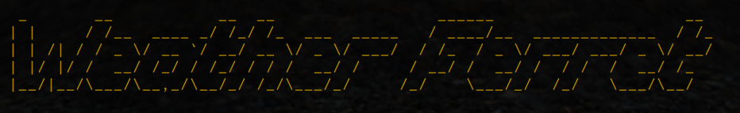
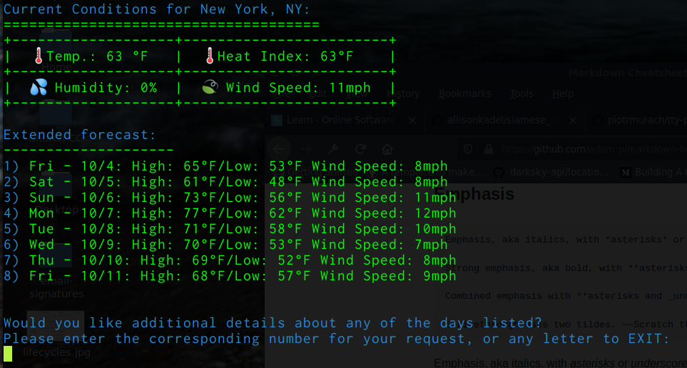
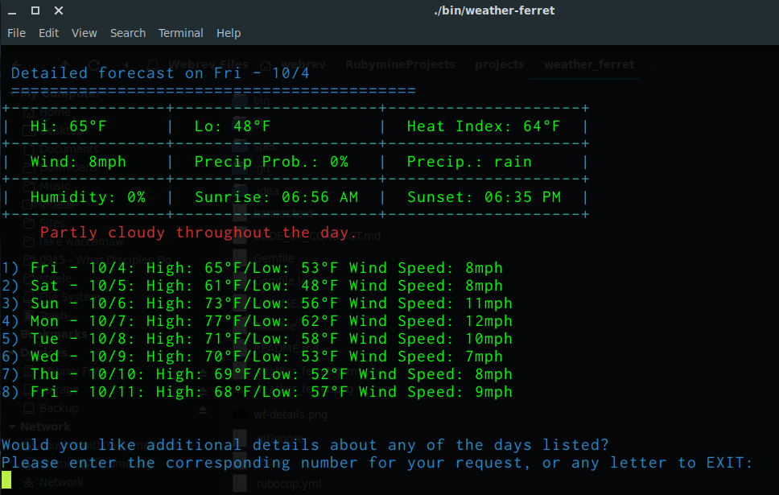

# WeatherFerret


Welcome to `Weather Ferret`. What is a Ferret? Yes, of course, a little furry animal, but to _ferret_, also, means to "`look around in search of something`." This gem provides you with a command-line application that lets you query for a weather forecast by providing a location. It uses the [Dark Sky API]() to access both the current conditions, and an extended eight day forecast. The user has the option to get further details on any of the days provided. Happy ferreting!


### Installation

Add this line to your application's Gemfile:

```ruby
gem 'weather_ferret'
```

And then execute:

    $ bundle

Or install it yourself as:

    $ gem install weather_ferret

### Usage

The program workflow is as follows:
- When the program starts the user is asked to enter a location.
- The user is asked to verify their response.
- The responses is validated. 

After the data entry and validation, `Weather Ferret` contacts two API's
- First, using a gem called `Geocoder`, it converts the location to coordinates (latitude and longitude). 
- Second, via a gem called `Forecast_IO`, which is a wrapper for the Dark Sky API, displays a set of information (see screenshot below):



The user can select to exit the application or view more details:



### TODO: Future Features   
This is a running list of features on a wish list to integrate:   
- Add caching to `Geocoder` to limit the amount of API calls to convert locations to coordinates.
- Add custom weather emoji's based on the `icon` field from `Dark Sky API`.
- Add settings feature to handle units instead of hard coding them (i.e. mph vs. kmp, F vs. C)

## Development

After checking out the repo, run `bin/setup` to install dependencies. Then, run `rake spec` to run the tests. You can also run `bin/console` for an interactive prompt that will allow you to experiment.

To install this gem onto your local machine, run `bundle exec rake install`. To release a new version, update the version number in `version.rb`, and then run `bundle exec rake release`, which will create a git tag for the version, push git commits and tags, and push the `.gem` file to [rubygems.org](https://rubygems.org).

## Contributing

Bug reports are welcome on GitHub at https://github.com/eclectic-coding/weather_ferret/issues. This project is intended to be a safe, welcoming space for collaboration, and contributors are expected to adhere to the [Contributor Covenant](http://contributor-covenant.org) code of conduct.

## License

The gem is available as open source under the terms of the [MIT License](https://opensource.org/licenses/MIT).

## Code of Conduct

Everyone interacting in the WeatherFerret project’s codebases, issue trackers, chat rooms and mailing lists is expected to follow the [code of conduct](https://github.com/eclectic-coding/weather_ferret/blob/master/CODE_OF_CONDUCT.md).
